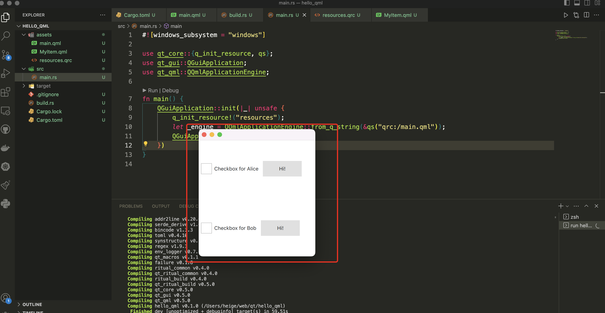

# qt-in-action
qt in action notes

# rust环境安装
参考 rust-install.md

# rust-qt 快速开始
rust-qt接入说明：由于rust-qt 暂时只支持qt5，建议安装qt5版本，使用qt5和rust-qt实现绑定

1. 参考 mac-qt5-install.md 安装好qt5
2. 确保你已安装好rust，并设置好对应的环境变量，参考 rust-install.md
3. 切换到 qt-examples/hello_qml 目录，执行`cargo run`就可以看到效果如下：

# rust-qt
官方链接：https://github.com/rust-qt

官方examples: https://github.com/rust-qt/examples

# rust-qt核心组件库
https://github.com/rust-qt/ritual

# rust-qt 练手实战
https://juejin.cn/post/7227624340232208443

# cxx-qt
- cxx-qt必须安装的工具：https://github.com/KDAB/cxx-qt#building
- qt6安装请参考：mac-qt6-install.md
- cxx-qt 完整的demo: qt-examples/cxx_hello

## cxx-qt 相关文档
- 官方地址： https://github.com/KDAB/cxx-qt
- cxx-qt使用手册：https://kdab.github.io/cxx-qt/book/
- cxx-qt中文使用参考：https://github.com/jason-yau/cxx-qt-book/blob/main/src/SUMMARY.md
- cxx-qt实战案例：https://dev.to/logrocket/build-a-desktop-app-with-qt-and-rust-1cfi
- cxx-qt架构设计，是非常漂亮且清晰的（强烈推荐）

# qmetaobject-rs
Requires Qt >= 5.8
参考文档：
- https://github.com/woboq/qmetaobject-rs
- https://woboq.com/blog/qmetaobject-from-rust.html
- https://lib.rs/crates/qmetaobject

# 关于rust qt绑定选择
- rust-qt目前只支持qt5版本，并且暂时没维护了
- cxx-qt 目前最低支持qt5.15版本，它是KDAB出品的，跨平台支持linux,macos,windows等不同的操作系统，它支持cmake和cargo两种构建方式（cargo这种方式，通过rust cxx-qt-build工具生成c++代码，编译生成二进制文件），同时支持c/c++和rust相互调用和代码生成，Safe interop between Rust and Qt
- gtk-rs 相对来说文档是比较全面的，gtk底层完全基于c语言编写的，跨平台，支持linux,mac os,windows等不同平台，目前gtk-rs目前已经到了[gtk4-rs](https://github.com/gtk-rs/gtk4-rs)
  开发文档 https://gtk-rs.org/gtk4-rs/stable/latest/book/introduction.html https://www.cnblogs.com/nsfoxer/p/16530314.html 是比较全面的。
- qmetaobject-rs 它是一个qml+rust代码写qt项目的一个rust库。对于qml来说，支持js交互，同时它是一个rust qt框架，使每个人都可以用Rust创建Qt/QML应用程序。使用这个crate的开发人员，不需要输入任何c++代码，也不需要使用cargo之外的其他构建系统。

综合对比
  - 推荐使用cxx-qt这个库，需要懂一些c/c++基础，比如说header头引入以及c++简单的语法，能看懂一部分c++代码（这块主要是qt接口函数，api调用需要）。
  - 另外，如果对于c有一定的基础，选择gtk-rs也是不错的选择，开发文档对于开发人员来说，非常友好，也值得推荐。
  - 对于想用rust+qml语法以及js语言交互的开发人员(特别适合qt开发的新手快速上手）来说，qmetaobject是一个非常不错的选择，构建方式是采用纯cargo的方式，构建出来的代码是安全的rust代码，满足了稳定性和可靠性。在性能这块，它避免任何不必要的转换或堆分配。

# qml基础语法学习
- https://zhuanlan.zhihu.com/p/645635569 QML语法——基础篇
- https://zhuanlan.zhihu.com/p/634278695 QML 的基本语法
- https://zhuanlan.zhihu.com/p/645889152 QML语法-对象篇(一)
- https://zhuanlan.zhihu.com/p/645891774 QML语法-对象篇(二)
- https://zhuanlan.zhihu.com/p/652515675 QML语法编程指南
- https://zhuanlan.zhihu.com/p/624896235 QML调用函数

# Qt6 QML Book
https://zhuanlan.zhihu.com/p/517525413

# 更多qt用法：
https://www.zhihu.com/people/80-70-85-66/posts
