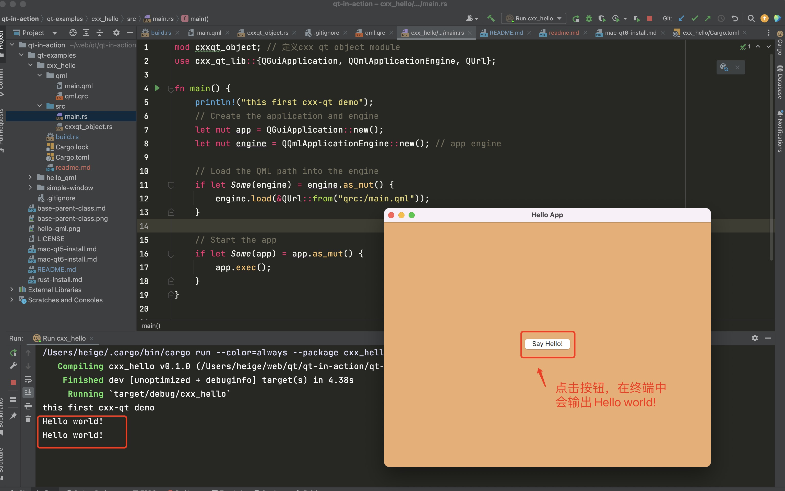

# cxx_hello
    cxx-qt 完整的demo

# cxx-qt 快速上手
1. 创建一个rust应用
```shell
cargo new cxx_hello
```
在 Cargo.toml 文件中添加依赖
```toml
[dependencies]
cxx = "1.0.107"
cxx-qt = "0.5.3"
cxx-qt-lib = "0.5.3"

[build-dependencies]
cxx-qt-build = "0.5.3"
```
执行如下命令，拉对应的crates
```shell
cargo check
```

2. 创建 cxx_hello/qml目录

在其目录下分别建立 main.qml 和 qml.qrc 文件，接着在main.qml文件中添加如下内容：
```qml
// qml/main.qml

import QtQuick.Controls 2.12
import QtQuick.Window 2.12

// This must match the qml_uri and qml_version
// specified with the #[cxx_qt::qobject] macro in Rust.
// 这里的导入名字必须要 cxxqt_object.rs的 一致
// #[cxx_qt::qobject(qml_uri = "hello", qml_version = "1.0")]
import hello 1.0

Window {
    title: qsTr("Hello App")
    visible: true
    height: 480
    width: 640
    color: "#e4af79"

    Hello {
        id: hello
    }

    Column {
        anchors.horizontalCenter: parent.horizontalCenter
        anchors.verticalCenter: parent.verticalCenter
        /* space between widget */
        spacing: 10

        Button {
            text: "Say Hello!"
            onClicked: hello.sayHello()
        }
    }
}
```
在qml.qrc中添加如下内容：
```xml
<!DOCTYPE RCC>
<RCC version="1.0">
    <qresource prefix="/">
        <file>main.qml</file>
    </qresource>
</RCC>
```
3. 创建构建文件 cxx_hello/build.rs，并在build.rs中添加如下内容：
```rust
use cxx_qt_build::CxxQtBuilder;

// cxx_hello 构建之前执行的动作
fn main() {
    CxxQtBuilder::new()
        // Link Qt's Network library
        // - Qt Core is always linked
        // - Qt Gui is linked by enabling the qt_gui Cargo feature (default).
        // - Qt Qml is linked by enabling the qt_qml Cargo feature (default).
        // - Qt Qml requires linking Qt Network on macOS
        .qt_module("Network")
        // Generate C++ from the `#[cxx_qt::bridge]` module
        .file("src/cxxqt_object.rs")
        // Generate C++ code from the .qrc file with the rcc tool
        // https://doc.qt.io/qt-6/resources.html
        .qrc("qml/qml.qrc")
        .setup_linker()
        .build();
}
```
4. 在cxx_hello/src目录中建立 cxxqt_object.rs
在文件中添加如下内容：
```rust
#[cxx_qt::bridge]
mod my_object {

    #[cxx_qt::qobject(qml_uri = "hello", qml_version = "1.0")]
    #[derive(Default)]
    pub struct Hello {}

    // 为 Hello 实现say_hello方法
    impl qobject::Hello {
        #[qinvokable]
        pub fn say_hello(&self) {
            println!("Hello world!")
        }
    }
}
```
5. 入口文件 src/main.rs 添加如下内容：
```rust
mod cxxqt_object; // 定义cxx qt object module
use cxx_qt_lib::{QGuiApplication, QQmlApplicationEngine, QUrl};

fn main() {
    println!("this first cxx-qt demo");
    // Create the application and engine
    let mut app = QGuiApplication::new();
    let mut engine = QQmlApplicationEngine::new(); // app engine

    // Load the QML path into the engine
    if let Some(engine) = engine.as_mut() {
        engine.load(&QUrl::from("qrc:/main.qml"));
    }

    // Start the app
    if let Some(app) = app.as_mut() {
        app.exec();
    }
}
```
当我们完成上面的步骤后，整个cxx_hello的目录结构就是这个样子：
```shell
% tree . -L 3
.
├── Cargo.lock
├── Cargo.toml
├── build.rs
├── qml
│ ├── main.qml
│ └── qml.qrc
├── readme.md
└── src
    ├── cxxqt_object.rs
    └── main.rs
```

# 开始运行
```shell
cargo run # 会开始执行构建并运行
```
执行该命令后，你的电脑会自动打开一个桌面应用，效果如下：

当这里为止，恭喜你成功创建了一个cxx-qt demo!

# cxx-qt 文档
- 官方地址： https://github.com/KDAB/cxx-qt
- cxx-qt使用手册：https://kdab.github.io/cxx-qt/book/
