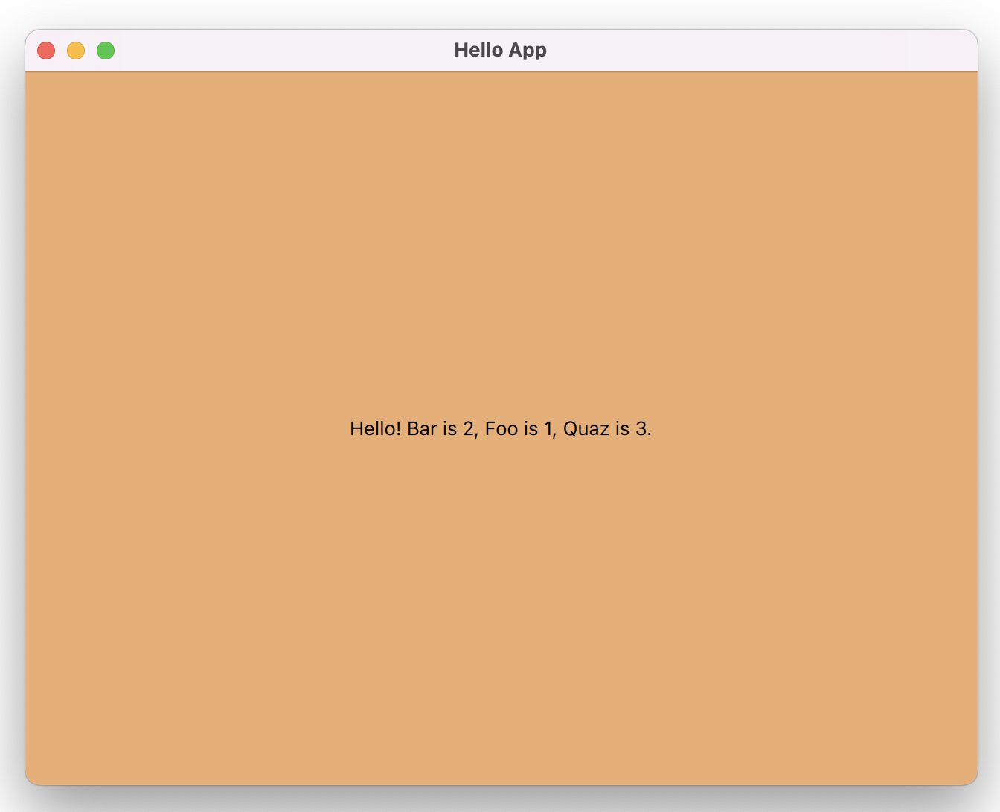
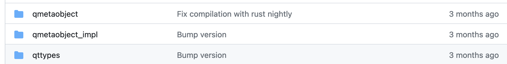
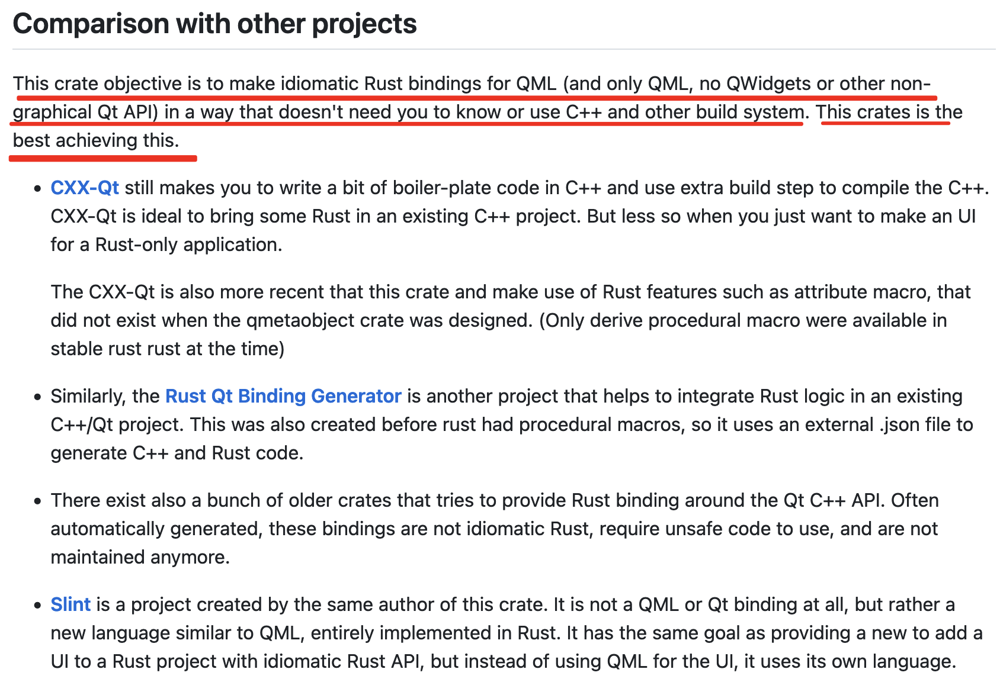

# qmetaobject-rs
- rust qt绑定，qmetaobject-rs是一个qml+rust代码写qt项目的一个rust库。对于qml来说，支持js交互。
- 它是一个rust qt框架，使每个人都可以用Rust创建Qt/QML应用程序。
- 它通过在编译时构建QMetaObjects、注册QML类型(QQmlExtensionPlugins使用是可选的，根据实际情况使用)和提供习惯的包装器来实现这一点。

# qmetaobject-rs 实战demo
https://github.com/daheige/qt-in-action/tree/main/qt-examples


# 官方地址
https://github.com/woboq/qmetaobject-rs
核心组成：

在开发的时候，只需要依赖这几个crate:
```toml
[dependencies]
qmetaobject = "0.2.9"  # qmetaobject
qttypes = { version = "0.2.9", features = [ "qtquick"] }
cstr="0.2.11"
cpp = "0.5.9"

[build-dependencies]
# 构建build.rs使用的包
#cpp_build = "0.5.9" # 部分内容需要cpp编译
#semver="1.0.18" # 可用于版本号构建使用
```

# 使用说明
- https://woboq.com/blog/qmetaobject-from-rust.html
- https://lib.rs/crates/qmetaobject

# qmetaobject-rs 的优势
主要体现在下面几点：
- 通过Rust过程宏(自定义派生)在编译时生成QMetaObject。
- 主要Qt类型的绑定使用cpp!从CPP板条箱中的宏。
- 使用这个crate的开发人员，不需要输入任何c++代码，也不需要使用cargo之外的其他构建系统。
- 关于性能，避免任何不必要的转换或堆分配。

# 各种qt绑定比较


# Features
Create object inheriting from QObject, QQuickItem, QAbstractListModel, QQmlExtensionPlugin, ...
Export Qt properties, signals, methods, ...
Also support #[derive(QGadget)] (same as Q_GADGET)
Create Qt plugin (see examples/qmlextensionplugins)
Partial scene graph support

# Qt version
Requires Qt >= 5.8
