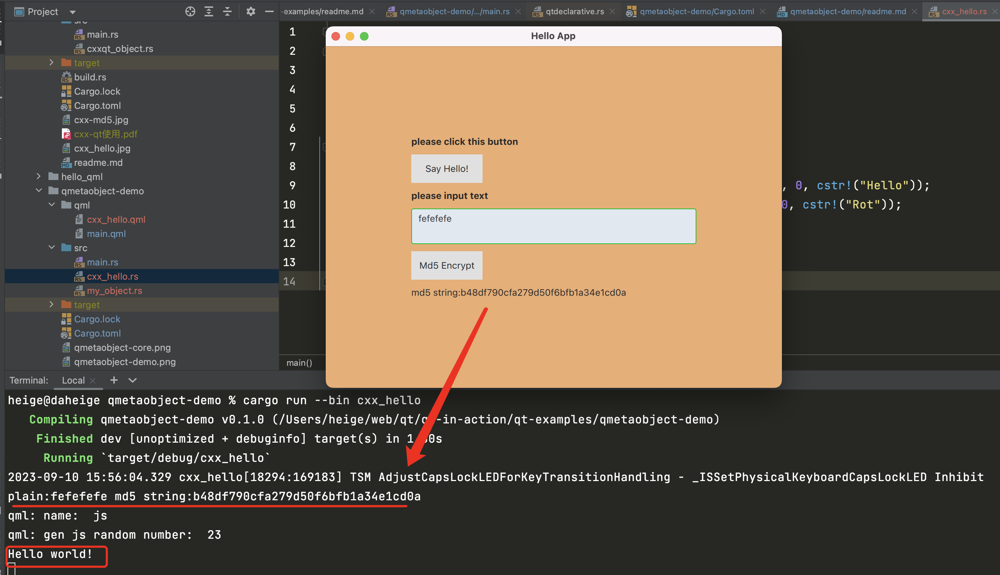

# qmetaobject-rs
- rust qt绑定，qmetaobject-rs是一个qml+rust代码写qt项目的一个rust库。对于qml来说，支持js交互。
- 它是一个rust qt框架，使每个人都可以用Rust创建Qt/QML应用程序。
- 它通过在编译时构建QMetaObjects、注册QML类型(QQmlExtensionPlugins使用是可选的，根据实际情况使用)和提供习惯的包装器来实现这一点。

# qmetaobject-rs 实战demo
https://github.com/daheige/qt-in-action/tree/main/qt-examples/qmetaobject-demo

qml/main.qml
```qml
import QtQuick 2.12;
import QtQuick.Window 2.12;

// Import our Rust classes
// 这个版本名称，必须和main.rs qml_register 注册的名称一样
import qRustCode 1.0;

Window {
    visible: true
    title: "Hello App"
    height: 480
    width: 640
    color: "#e4af79"

    Text {
        anchors.centerIn: parent
        text: "Hello! Bar is"+Options.Bar+", Foo is "+Options.Foo+", Quaz is "+Options.Quaz+"."
    }
}
```
main.rs
```rust
use cstr::cstr;
use qmetaobject::prelude::*;
use qttypes::QString;

#[derive(Copy, Clone, Debug, Eq, PartialEq, QEnum)]
#[repr(C)]
enum Options {
    Foo = 1,
    Bar = 2,
    Quaz = 3,
}

fn main() {
    // 注册qml名字，版本号，传递给qml文件中rust enum变量
    qml_register_enum::<Options>(cstr!("qRustCode"), 1, 0, cstr!("Options"));

    let mut engine = QmlEngine::new();
    engine.load_file(QString::from("qml/main.qml"));
    engine.exec();
}
```
https://github.com/daheige/qt-in-action/tree/main/qt-examples


# 采用qmetaobject重写cxx_hello
1. 定义qml/cxx_hello.qml
```qml
import QtQuick 2.12;
import QtQuick.Controls 2.12;
import QtQuick.Window 2.12;
// import QtQuick.Controls.Basic 2.12;

// Import our Rust classes
// 这个版本名称，必须和main.rs qml_register 注册的名称一样
import qRustCode 1.0;

Window {
    visible: true
    title: "Hello App"
    height: 480
    width: 640
    color: "#e4af79"

    // 自定义的Hello类型
    Hello {
        id: hello
    }

    // 自定义的Rot类型
    Rot {
        id: rot // 唯一标识
        plain: ""
        secret: ""
    }

    Column {
        anchors.horizontalCenter: parent.horizontalCenter
        anchors.verticalCenter: parent.verticalCenter
        /* space between widget */
        spacing: 10

        // 实现say hello功能
        Label {
            text: "please click this button"
            font.bold: true
        }

        Button {
            text: "Say Hello!"
            onClicked: {
                // 支持js es5/es6语法
                let name = "js";
                console.log("name: ", name);

                // 生成m-n的随机数字
                let m = 1;
                let n = 100;
                let rnd = Math.floor(Math.random() * (n - m)) + m;
                console.log("gen js random number: ", rnd);

                // 调用Hello上面的say_hello方法
                hello.say_hello();
            }
        }

        // 实现md5加密功能
        Label {
            text: "please input text"
            font.bold: true
        }
        TextArea {
            placeholderText: qsTr("origin string")
            text: rot.plain
            onTextChanged: rot.plain = text
            background: Rectangle {
                implicitWidth: 400
                implicitHeight: 50
                radius: 3
                color: "#e2e8f0"
                border.color: "#21be2b"
            }
        }

        Button {
            text: "Md5 Encrypt"
            onClicked: {
                // js语法赋值操作
                // console.log("plain: ", rot.plain);
                let secret = rot.md5(rot.plain);
                // console.log("secret: ", rot.secret);

                // 赋值后，就会自动填充 Label 中的text
                rot.secret = secret;
            }
        }

        Label {
            text: rot.secret
        }
    }
}
```

如果你使用的qt是5.9版本，那么qml/cxx_hello.qml如下：
qml仅支持es5语法
```qml
import QtQuick 2.0;
import QtQuick.Controls 2.0;
import QtQuick.Window 2.0;

// Import our Rust classes
// 这个版本名称，必须和main.rs qml_register 注册的名称一样
import qRustCode 1.0;

Window {
    visible: true
    title: "Hello App"
    height: 480
    width: 640
    color: "#e4af79"

    // 自定义的Hello类型
    Hello {
        id: hello
    }

    // 自定义的Rot类型
    Rot {
        id: rot // 唯一标识
        plain: ""
        secret: ""
    }

    Column {
        anchors.horizontalCenter: parent.horizontalCenter
        anchors.verticalCenter: parent.verticalCenter
        /* space between widget */
        spacing: 10

        // 实现say hello功能
        Label {
            text: "please click this button"
            font.bold: true
        }

        Button {
            text: "Say Hello!"
            onClicked: {
                // 支持js es5语法
                var name = "js";
                console.log("name: "+name);

                // 生成m-n的随机数字
                var m = 1;
                var n = 100;
                var rnd = Math.floor(Math.random() * (n - m)) + m;
                console.log("gen js random number: "+rnd);

                // 调用Hello上面的say_hello方法
                hello.say_hello();
            }
        }

        // 实现md5加密功能
        Label {
            text: "please input text"
            font.bold: true
        }
        TextArea {
            placeholderText: qsTr("origin string")
            text: rot.plain
            onTextChanged: rot.plain = text
            background: Rectangle {
                implicitWidth: 400
                implicitHeight: 50
                radius: 3
                color: "#e2e8f0"
                border.color: "#21be2b"
            }
        }

        Button {
            text: "Md5 Encrypt"
            onClicked: {
                // js语法赋值操作
                // console.log("plain: ", rot.plain);
                var secret = rot.md5(rot.plain);
                // console.log("secret: ", rot.secret);

                // 赋值后，就会自动填充 Label 中的text
                rot.secret = secret;
            }
        }

        Label {
            text: rot.secret
        }
    }
}
```
2. 在Cargo.toml中添加如下内容：
```toml
# 使用qmetaobject-rs重写cxx_hello
[[bin]]
name = "cxx_hello"
path = "src/cxx_hello.rs"
```
3. 在src目录下面新增cxx_hello.rs文件
```rust
use qttypes::QString;
use qmetaobject::prelude::*;

// 需要添加QObject trait
#[derive(Default,QObject)]
pub struct Hello {
    // Specify the base class with the qt_base_class macro
    base: qt_base_class!(trait QObject),
    say_hello:qt_method!(fn(&self)->()), // 定义的say_hello方法
}

// 为 Hello 实现say_hello方法
impl Hello {
    pub fn say_hello(&self) {
        println!("Hello world!");
    }
}

#[derive(Default,QObject)]
pub struct Rot {
    // Specify the base class with the qt_base_class macro
    base: qt_base_class!(trait QObject),

    // 属性用 qt_property!包裹起来
    name: qt_property!(QString; NOTIFY name_changed),
    // Declare a signal
    name_changed: qt_signal!(),

    plain: qt_property!(QString; NOTIFY name_changed),
    // Declare a signal
    plain_changed: qt_signal!(),

    secret: qt_property!(QString; NOTIFY secret_changed),
    // Declare a signal
    secret_changed: qt_signal!(),
    md5:qt_method!(fn(&self, plain: String) -> QString)
}

impl Rot {
    // 实现md5加密
    pub fn md5(&self, plain: String) -> QString {
        if plain.is_empty() {
            return QString::from("plain is empty");
        }

        let digest = md5::compute(&plain);
        let md5_str = format!("{:x}", digest); // 生成md5 string
        println!("plain:{} md5 string:{}", plain, md5_str);
        let result = format!("md5 string:{}", md5_str);
        QString::from(result.as_str())
    }
}
```

4. 开始运行，执行如下命令
```shell
cargo run --bin cxx_hello # 就会启动一个窗口程序
```
运行效果如下：


# 关于qt版本选择
请尽量使用qt5.15+版本，因为js es6语法，需要5.14+版本，否则qml里面的let请依旧使用es5语法。

# 官方地址
https://github.com/woboq/qmetaobject-rs
核心组成：

在开发的时候，只需要依赖这几个crate:
```toml
[dependencies]
qmetaobject = "0.2.9"  # qmetaobject
qttypes = { version = "0.2.9", features = [ "qtquick"] }
cstr="0.2.11"
cpp = "0.5.9"

[build-dependencies]
# 构建build.rs使用的包
#cpp_build = "0.5.9" # 部分内容需要cpp编译
#semver="1.0.18" # 可用于版本号构建使用
```

# 使用说明
- https://woboq.com/blog/qmetaobject-from-rust.html
- https://lib.rs/crates/qmetaobject

# qmetaobject-rs 的优势
主要体现在下面几点：
- 通过Rust过程宏(自定义派生)在编译时生成QMetaObject。
- 主要Qt类型的绑定使用cpp!宏来导入c++类型实现，最终会通过cargo build生成rust类型，编译到二进制文件中。
- 使用这个crate的开发人员，不需要输入任何c++代码，也不需要使用cargo之外的其他构建系统。
- 关于性能，避免任何不必要的转换或堆分配。

# 各种qt绑定比较


# Features
Create object inheriting from QObject, QQuickItem, QAbstractListModel, QQmlExtensionPlugin, ...
Export Qt properties, signals, methods, ...
Also support #[derive(QGadget)] (same as Q_GADGET)
Create Qt plugin (see examples/qmlextensionplugins)
Partial scene graph support

# Qt version
Requires Qt >= 5.8
